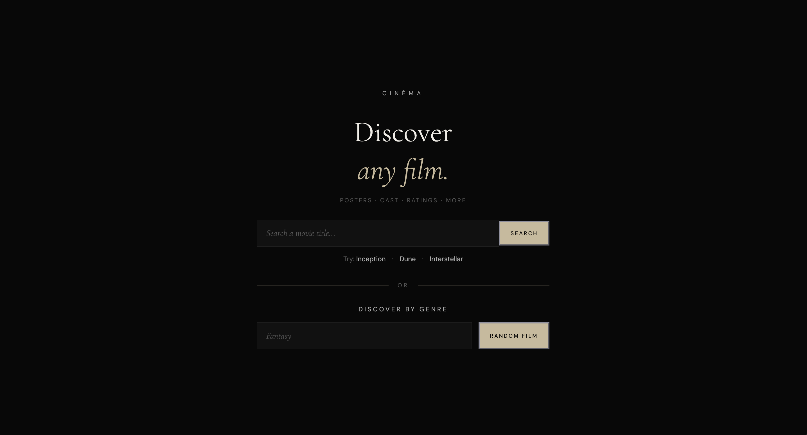
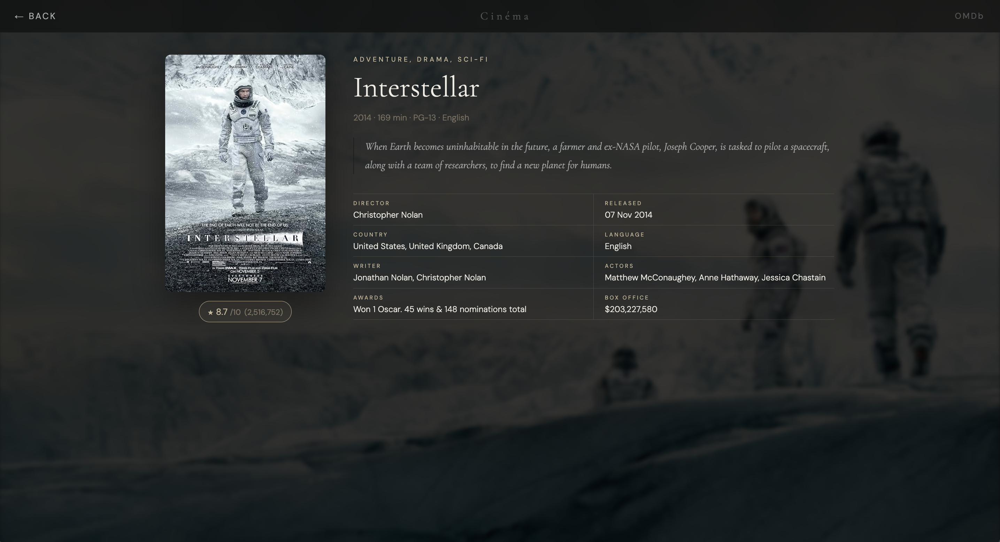

# 🎬 Cinéma

Cinéma is a cinematic movie discovery web application that combines the power of OMDb and TMDB APIs. Search for any movie or discover a random title by genre, with detailed information, dynamic backdrops, and an elegant minimalist interface.

---

## ✨ Features

* 🔍 Search movies by title
* 🎲 Discover random movies by genre
* 🎬 Dynamic cinematic backdrops powered by TMDB
* 🖼️ High-quality movie posters
* ⭐ IMDb ratings & vote count
* 📝 Full movie plot
* 🎭 Cast & crew information
* 🏆 Awards
* 💰 Box office collection
* 🌍 Language & country
* 📱 Fully responsive design
* ⚡ Fast loading experience

---

## 🛠️ Built With

* HTML5
* CSS3
* JavaScript (ES6)
* OMDb API
* TMDB API

---

## 🚀 How It Works

### Search

Search any movie title using the **OMDb API** to retrieve complete movie information.

### Discover

Select a genre and let **TMDB** recommend a random movie. The application then fetches detailed information from **OMDb** using the movie's IMDb ID, combining the best of both APIs.

---

## 📷 Preview

### Landing Page



### Movie Details



---

## ⚙️ Installation

```bash
git clone https://github.com/atetoon/cinema-search

cd cinema
```

Add your API keys inside `helpers.js`.

```javascript
const TMDB_API_KEY = "YOUR_TMDB_API_KEY";
const OMDB_API_KEY = "YOUR_OMDB_API_KEY";
```

Open `index.html` in your browser.

---

## 📁 Project Structure

```
Cinema/
│
├── index.html
├── style.css
├── script.js
├── helpers.js
└── README.md
```

---

## 🌐 APIs Used

### OMDb API

Used for:

* Movie details
* Ratings
* Plot
* Cast
* Awards
* Box Office
* IMDb information

### TMDB API

Used for:

* Genre list
* Random movie discovery
* Cinematic backdrop images

---

## 🎯 Future Improvements

* ❤️ Favorites / Watchlist
* 🎥 Movie trailers
* 📺 TV show support
* 🌙 Dark/Light themes
* 🎭 Actor profiles
* 🎬 Similar movie recommendations
* 📈 Trending & Popular movies

---

## 📄 License

This project is licensed under the MIT License.

---

Made with ❤️ for movie lovers.
